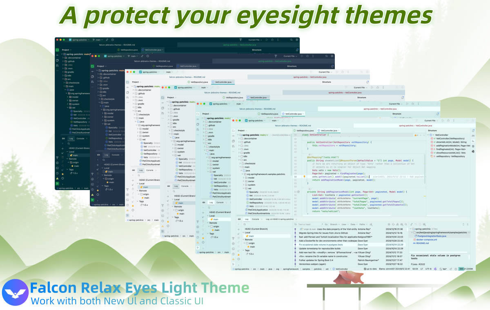
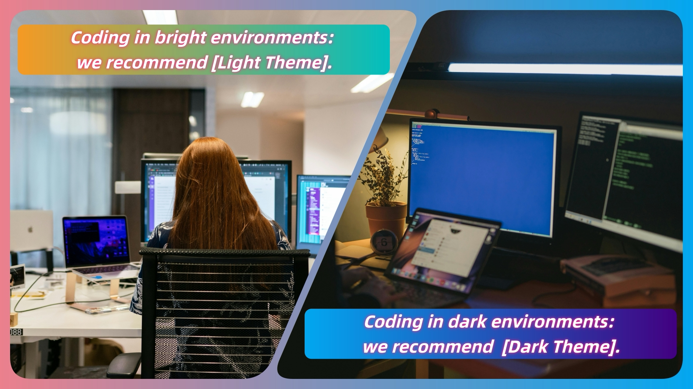
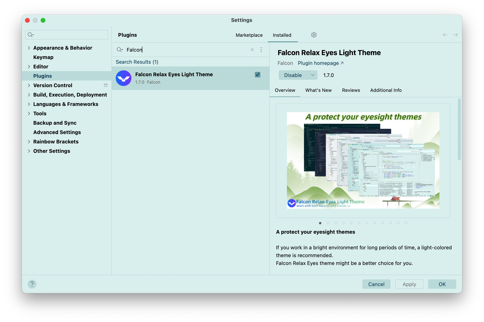
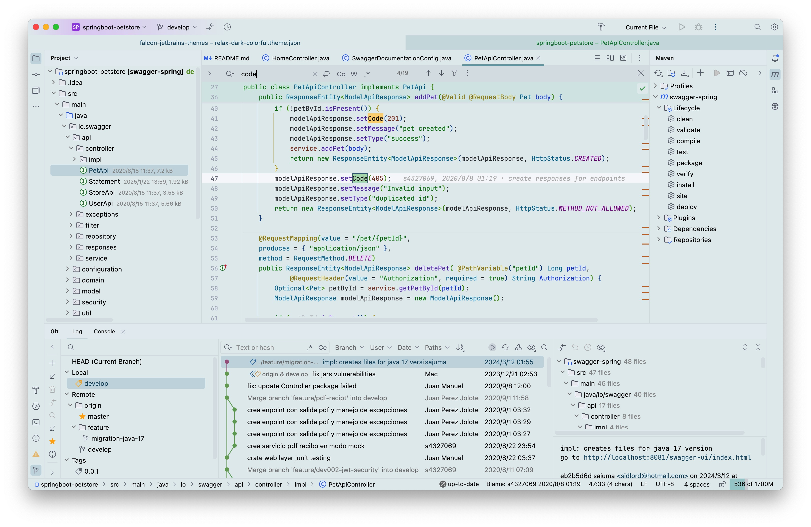

# Falcon Relaxing-Eyes Themes

> A gentle, eye-friendly theme to protect your eyesight for [Visual Studio Code](https://code.visualstudio.com/)  
> 一个温和的，对眼睛友好，保护视力的 VS Code 主题

If you're working in a bright environment for extended periods, a light-colored theme is usually better.
 
You might want to try The Falcon Relaxing-Eyes Themes. 

在明亮的工作环境中，长时间使用 VS Code，建议使用浅色主题，减少视觉疲劳。 

> <a href="https://ux.stackexchange.com/questions/53264/dark-or-white-color-theme-is-better-for-the-eyes">Dark or white color theme is better for the eyes?</a>

**Features:**

- Well-balanced colors, easy on eyes
- Better syntax highlight
- Unified and clean themes style
- Lightweight and low impact on `VS Code` performance

**Falcon Relaxing-Eyes Light themes (for bright environments):**

- Falcon Light Celadon
- Falcon Light Pink
- There is more coming soon!!!

**Falcon Relaxing-Eyes Dark themes (for low-light environments):**

- There is more coming soon!!!

<a href="https://github.com/panxiaoan/falcon-vscode-themes/issues">Report an issue</a>

[VS Code Marketplace](https://marketplace.visualstudio.com/VSCode)

## Many thanks the following projects:

1. [Dracula Theme](https://draculatheme.com/visual-studio-code)

## Source Code

1. [Github](https://github.com/panxiaoan/falcon-vscode-themes)

## Screenshot

1. Relax Light Celadon

    

2. Relax Light Pink

## License

[MIT License](./LICENSE.txt)